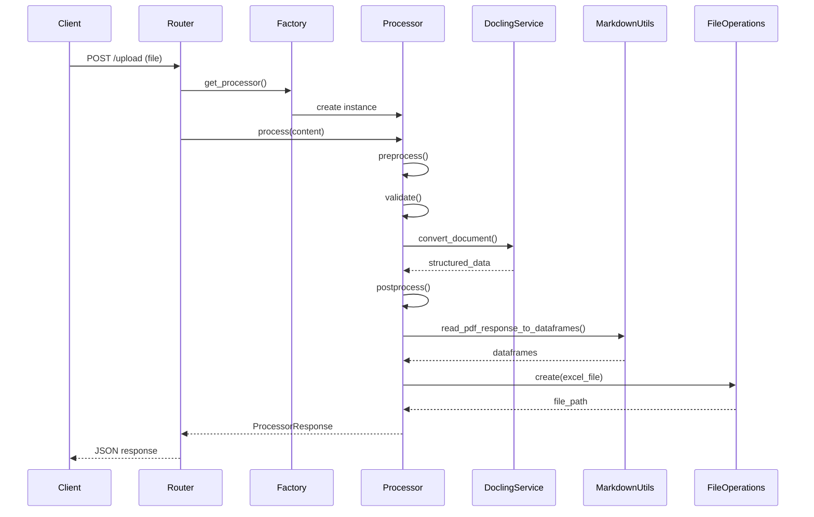

# Architecture

System architecture and design patterns used in the Banking API.

## Overview

The Banking API follows a layered architecture pattern with clear separation of concerns:

- **Routers**: Handle HTTP requests and responses
- **Services**: Business logic and external integrations
- **Processors**: Document processing pipeline
- **Models**: Data structures and validation
- **Utils**: Shared utilities and helpers
- **Interfaces**: Abstract contracts for implementations

## Project Structure

```
banking-api/
├── app/
│   ├── main.py                    # FastAPI application entry point
│   │
│   ├── models/                    # Pydantic models (organized by domain)
│   │   ├── __init__.py
│   │   ├── user.py                # User models
│   │   ├── account.py             # Account models
│   │   ├── transaction.py         # Transaction models
│   │   └── documents/             # Document processing models
│   │       ├── document.py        # Document models
│   │       └── processor.py       # ProcessorResponse model
│   │
│   ├── routers/                   # API endpoints
│   │   ├── __init__.py
│   │   ├── users.py               # User endpoints
│   │   ├── accounts.py            # Account endpoints
│   │   ├── transactions.py        # Transaction endpoints
│   │   └── documents.py           # Document processing endpoints
│   │
│   ├── processors/                # Document processors
│   │   ├── factory.py             # Processor factory pattern
│   │   └── pdf_processor.py       # PDF processing implementation
│   │
│   ├── services/                  # Business logic services
│   │   └── docling.py             # Docling integration service
│   │
│   ├── utils/                     # Utility functions
│   │   ├── logger.py              # Logging configuration
│   │   ├── markdown.py            # Markdown and table utilities
│   │   └── file_operations.py    # File CRUD operations
│   │
│   ├── interfaces/                # Abstract interfaces
│   │   ├── crud_interface.py      # Generic CRUD interface
│   │   ├── processor_interface.py # Document processor interface
│   │   ├── processor_factory_interface.py # Factory interface
│   │   └── docling_service_interface.py   # Service interface
│   │
│   └── enums/                     # Enumeration types
│       ├── __init__.py
│       ├── file_extensions.py     # Supported file extensions
│       ├── mime_types.py          # MIME type definitions
│       ├── processing_status.py   # Processing status codes
│       └── logging_levels.py      # Logging level definitions
│
├── files/                         # Exported files directory
├── logs/                          # Application logs
├── docs/                          # Documentation
├── .env.example                   # Environment variables template
├── .env.local                     # Local environment configuration
├── .gitignore                     # Git ignore rules
├── pyproject.toml                 # Poetry configuration
├── poetry.lock                    # Poetry lock file
├── LICENSE                        # Apache 2.0 license
└── README.md                      # Project documentation
```

## Document Processing Pipeline

The document processing system follows a sophisticated multi-stage pipeline:

### 1. Upload & Validation

```
Client Request → Router → Validation
                           ├─ File size check
                           ├─ File type validation
                           └─ Content validation
```

**Components:**
- [`documents.py`](../app/routers/documents.py) - Handles upload endpoint
- Environment variable `MAX_FILE_SIZE_MB` - Configurable size limit

### 2. Processor Selection

```
Validated File → Factory → Processor Selection
                            ├─ Extension detection
                            ├─ MIME type check
                            └─ Processor instantiation
```

**Components:**
- [`factory.py`](../app/processors/factory.py) - Factory pattern implementation
- [`processor_interface.py`](../app/interfaces/processor_interface.py) - Processor contract

### 3. Preprocessing

```
Raw Document → Preprocessor → Prepared Document
                              ├─ Encryption check
                              ├─ Password decryption (if needed)
                              └─ Format validation
```

**Components:**
- [`pdf_processor.py`](../app/processors/pdf_processor.py) - `preprocess()` method
- `pikepdf` library - PDF encryption handling

### 4. Document Extraction

```
Prepared Document → Docling Service → Structured Data
                                      ├─ Text extraction
                                      ├─ Table detection
                                      ├─ Image extraction
                                      └─ Metadata extraction
```

**Components:**
- [`docling.py`](../app/services/docling.py) - Docling integration
- Docling library - Advanced document processing

### 5. Postprocessing

```
Structured Data → Postprocessor → Enhanced Data
                                  ├─ Table to DataFrame conversion
                                  ├─ Data serialization
                                  └─ Confidence scoring
```

**Components:**
- [`pdf_processor.py`](../app/processors/pdf_processor.py) - `postprocess()` method
- [`markdown.py`](../app/utils/markdown.py) - DataFrame conversion utilities

### 6. File Export

```
DataFrames → File Operations → Excel Files
                               ├─ Multi-sheet creation
                               ├─ Timestamp generation
                               └─ File storage
```

**Components:**
- [`file_operations.py`](../app/utils/file_operations.py) - CRUD operations
- `pandas` + `openpyxl` - Excel generation

### 7. Response

```
Enhanced Data → Response Builder → Client Response
                                   ├─ JSON serialization
                                   ├─ Metadata inclusion
                                   └─ File path reference
```

**Components:**
- [`processor.py`](../app/models/documents/processor.py) - ProcessorResponse model
- Pydantic - Data validation and serialization

## Design Patterns

### Factory Pattern

Used for processor selection based on file type:

```python
# Factory creates appropriate processor
factory = DocumentProcessorFactory()
processor = factory.get_processor_by_extension("pdf")
```

**Benefits:**
- Extensible for new document types
- Centralized processor management
- Type-safe processor selection

### Interface Pattern

Abstract interfaces define contracts for implementations:

```python
class ProcessorInterface(ABC):
    @abstractmethod
    def process(self, content: bytes) -> ProcessorResponse:
        pass
```

**Benefits:**
- Clear contracts for implementations
- Easy to mock for testing
- Enforces consistent API

### CRUD Pattern

Generic CRUD interface for storage operations:

```python
class CrudInterface(ABC):
    @abstractmethod
    def create(self, **kwargs) -> Any:
        pass
    # ... other CRUD methods
```

**Benefits:**
- Flexible for multiple storage types
- Consistent API across implementations
- Easy to extend for new storage mechanisms

### Pipeline Pattern

Document processing follows a clear pipeline:

```
Upload → Validate → Preprocess → Extract → Postprocess → Export → Response
```

**Benefits:**
- Clear separation of concerns
- Easy to debug and maintain
- Extensible for new processing steps

## Data Flow

### Document Upload Flow



### DataFrame Conversion Flow

```
Tables (JSON) → MarkdownUtils → DataFrames (pandas)
                                 ├─ Column comparison
                                 ├─ Single or multiple DFs
                                 └─ Serialization
```

### File Storage Flow

```
DataFrames → FileOperations → File System
                              ├─ Directory check/creation
                              ├─ Excel generation
                              └─ Path return
```

## Component Responsibilities

### Routers
- HTTP request handling
- Input validation
- Response formatting
- Error handling

### Services
- External API integration
- Business logic
- Data transformation
- Configuration management

### Processors
- Document processing pipeline
- Format-specific handling
- Data extraction
- Quality assessment

### Models
- Data structure definition
- Validation rules
- Serialization logic
- Type safety

### Utils
- Shared functionality
- Helper functions
- Common operations
- Cross-cutting concerns

### Interfaces
- Contract definition
- Abstract methods
- Type hints
- Documentation

## Extensibility Points

### Adding New Document Types

1. Create processor implementing `ProcessorInterface`
2. Register in `DocumentProcessorFactory`
3. Add file extension to `FileExtension` enum
4. Add MIME type to `MimeType` enum

### Adding New Storage Backends

1. Implement `CrudInterface`
2. Update configuration
3. Inject into components
4. Test integration

### Adding New Processing Steps

1. Add method to processor
2. Call in pipeline
3. Update response model
4. Document behavior

## Performance Considerations

### Memory Management
- Streaming for large files
- Efficient DataFrame operations
- Proper resource cleanup

### Processing Optimization
- Parallel processing potential
- Caching strategies
- Lazy loading where appropriate

### Storage Optimization
- Configurable file locations
- Automatic cleanup options
- Compression support

## Security Considerations

### Input Validation
- File size limits
- Type checking
- Content validation

### Data Protection
- Password-protected PDF support
- Secure file storage
- Environment variable configuration

### Error Handling
- Graceful degradation
- Detailed logging
- User-friendly messages

## Future Architecture Improvements

- Database integration for persistence
- Caching layer (Redis)
- Message queue for async processing
- Microservices architecture
- API gateway
- Service mesh
- Monitoring and observability
- Distributed tracing